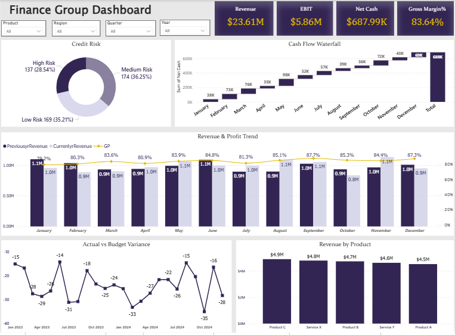

# Finance Performance Dashboard
## Project Overview
The Financial Performance Dashboard provides a comprehensive analysis of a company’s financial health by tracking revenue growth, profitability, cash flow, and working capital efficiency.
It enables stakeholders to monitor monthly trends, compare performance against budgets, and evaluate product/service profitability across different regions and timeframes.

## Tools Used

- Power BI – Dashboard design, KPI calculation, and visualization
- Excel – Data cleaning, transformation, and modeling
- DAX – Custom measures for financial KPIs
- Power Query – Data loading and shaping

## Objectives

To analyze and visualize the company’s financial performance over time, focusing on:

- Revenue growth trends
- Gross profit and EBITDA margins
- Budget vs actual performance
- Cash flow movement
- Product/service-wise revenue distribution
- Receivables efficiency

## Key KPIs

| Metric | Value | Description |
|:-----|:-----|:-----|
| Total Revenue | $23.61M | Total income generated by the company |
| Gross Margin | 83.64% | Profit Percent on COGS |
| EBIT% | $5.86M | Operating Profit as the percentage of revenue |
| YoY Growth | 0.08% | Year-over-Year revenue growth |
| MoM Growth% | 4.18% | Month-over-Month revenue change |
| Variance% | 23% | Budget vs Actual Variance Percentage |
| Average Receivable Age | 29.16 days | Average Period of Receivables |
| Average Payable Age | 30.34 days | Average Period of Payables |

## DAX & Calculated Measures

| Measures | Meaning |
|:-----|:-----|
| Total Revenue | Total income generated by the company from all sources. |
| Previous Revenue | Revenue generated in the previous period used for comparison. |
| Current Revenue | Revenue generated in the current period. |
| Variance % | Shows the percentage difference between current revenue and previous revenue. |
| YoY Growth % | Measures the percentage growth in revenue compared to the previous year. |
| Total Cash | Total available cash balance of the company at the end of the period. |
| EBIT % | Earnings before interest and tax as a percentage of total revenue, showing operational profitability. |
| Receivable Risk | Category indicating the risk level of outstanding receivables based on ageing. |
| Payable Risk | Category indicating the risk level of pending payables based on ageing. |

## Dashboard Component
| Chart | Purpose |
|:-----|:-----|
| Revenue & Profit Trend | Shows how the company’s revenue and profit are changing over time  |
| Cash Flow Waterfall | Explains how different cash inflows and outflows affect the final net cash position. |
| Actual vs Budget Variance | Compares actual financial performance with the planned budget to identify over or under performance. |
| Revenue By Product | Shows which products contribute the most to total revenue. |
| Credit Risk | Helps identify the level of risk in receivables based on ageing and payment delays. |

## Insights

-	Revenue Trend
EBIT Trend increases around 8% by December with steady market fluctuation in revenue.
-	Product Performance
Each Product contributes almost equally into total revenue with Product C and Service X have higher EBIT%.
-	Receivable Risk
Company’s 70% receivables are short-term (below 40 day) reflect the efficient working capital management.
-	Cash Flow
Company’s Total Net cash has been increased by 82% by the end of year reflect the strong positive cash flow.
-	Location
North region contributed highest in Total Revenue as well as EBIT.
-	Variance Analysis
Budgeted variance slightly increases with 7.5% by the current years.

## Action Plan

-	Implement a quarterly variance review framework to identify key cost or revenue gaps o bring variance back within the targeted threshold.
-	Maintain the strong collection cycle by introducing early-payment incentives for key customers and deploying automated follow-up alerts to prevent aging slippage.
-	Conduct the detail cost analysis to know more about hidden expences and non-adding value. 
-	Leverage the strong cash position by reinvesting it in high return assets to maintain company revenue and profitability.

## Conclusion

The dashboard provides a clear overview of the company’s financial performance by analyzing revenue, profit, cash flow, and credit risk. It helps track key financial trends, compare actual results with budget, and identify important business insights. Overall, the dashboard supports quick analysis and better financial decision-making.

## Dashboard Preview

